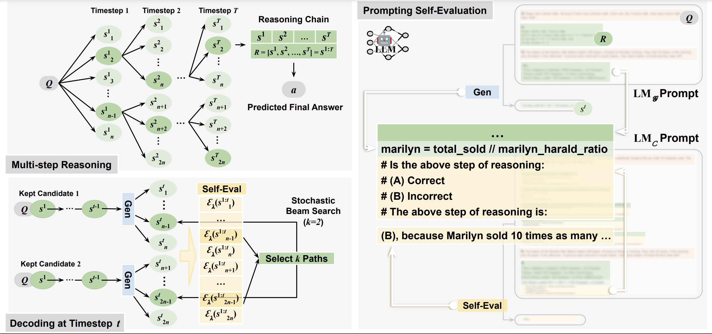

# SelfEval-Guided Decoding for Multi-step Reasoning

This repository contains code and analysis for the paper: [Decomposition Enhances Reasoning via Self-Evaluation Guided Decoding](https://arxiv.org/abs/2305.00633). 
Below is the framework of our proposed method (on the left) together with a prompting example of self-evaluation (on the right).



## To run NER experiments
```bash
set -x

split=test
dtname=ncbi

mkdir -p ${OUTPUTHOME}

cd ${EXEHOME}

python generate_code_llama.py --verbal \
    --dt_name ${dtname} \
    --model_name meta-llama/Llama-3.1-8B-Instruct \
    --input_file ${DATAHOME}/${dtname}_${split}.jsonl \
    --output_dir ${OUTPUTHOME} \
    --mini_n_samples 2 --mini_n_samples_eval 2 --max_tokens 52 \
    --beam_size 5 \
    --reject_sample --unbiased \
    --bs_temperature 0.0 --bs_temperature_decay 0.5 \
    --temperature 0.5 --n_samples 2 --conf_ratio 0
```

## What's New?
* `09/2023`: Llama-2 is supported. Please check example [scripts](./scripts/llama) for details.
* `07/2023`: Our algorithm of Guided Decoding is supported by [LLM-Reasoners](https://github.com/Ber666/llm-reasoners). You can utilize the library to better compare our method with other cutting-edge reasoning algorithms.
* `05/2023`: First release of the SelfEval Guided Decoding [pipeline](https://github.com/YuxiXie/SelfEval-Guided-Decoding) and [preprint](https://arxiv.org/abs/2305.00633).

## Requirements

#### Environment

```
openai                             0.27.1
matplotlib                         3.3.4
numpy                              1.20.1
ipdb                               0.13.9
tqdm                               4.64.1
```

#### Data Preprocessing

We provide example formats of the input dataset in the folder [`data`](data).
For other datasets, please check the details of [prompt construction](src/utils/prompt.py), where we show the specific attributes each data point should contain.

#### OpenAI Keys

In the current version of our main method (in [`generate_code.py`](src/generate_code.py)), we adopt [`Codex`](https://openai.com/blog/openai-codex) as our backend LLM.
However, OpenAI has discontinued public access to this model.
To address this, you can either (1) apply for the [research access](https://openai.com/form/researcher-access-program) to `Codex` (`code-davinci-002`) to run our approach, or (2) utilize an alternative backbone `text-davinci-003`.
We will later also release the results of running based on `text-davinci` models for reference.

## Running

We show examples of how to run our method on different datasets in [`scripts`](scripts). Specifically, scripts with names starting with `run_generation_` are for running our methods with either PAL or CoT as basic prompting methods.

## Post-Processing and Evaluating

Please find in [`src/execute_and_evaluate`](src/execute_and_evaluate/) how to extract and evaluate the outputs of different methods on different datasets. 

## Citation

```
@misc{xie2023decomposition,
      title={Decomposition Enhances Reasoning via Self-Evaluation Guided Decoding}, 
      author={Yuxi Xie and Kenji Kawaguchi and Yiran Zhao and Xu Zhao and Min-Yen Kan and Junxian He and Qizhe Xie},
      year={2023},
      eprint={2305.00633},
      archivePrefix={arXiv},
      primaryClass={cs.CL}
}
```

---
<sub><sup>This repository is adapted from the code of the works [PaL: Program-Aided Language Model](https://github.com/reasoning-machines/pal) and [Program of Thoughts Prompting: Disentangling Computation from Reasoning for Numerical Reasoning Tasks](https://github.com/wenhuchen/Program-of-Thoughts). </sup></sub>


