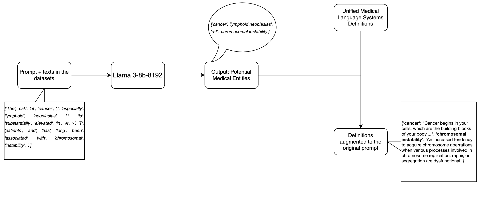

# UMLS definition extraction for potential medical entities

Below is the framework of our method for the extraction of potential medical entities along with their definitions from the Unified Medical Language System in order to implement a dictionary-infused Retrieval-Augmented Generation (RAG).



## Requirements

#### Environment

```
openai                             0.27.1
groq                               0.13.0
```

#### Dataset Usage

The three datasets used are the I2B2 dataset, the NCBI Disease corpus and the BioCreative II Gene Mention Recognition (BC2GM). The input dataset path must be defined for running the UMLS definition extraction process. 

#### Groq API Keys

The Groq API key needs to be specified in the code in order to give a prompt to llama3-8b-8192 and fetch the output.
The key can be generated by visiting and logging in to: https://console.groq.com/keys

#### UMLS data download
Download the UMLS data from : https://www.nlm.nih.gov/research/umls/licensedcontent/umlsknowledgesources.html
We used the UMLS Metathesaurus Level 0 Subset data for our process.
The data download required signing in through one of the identity providers - Google, Microsoft, research organization, login.gov, or NIH employees.
An agreement/form needs to be filled in order to get access to the data, the user can download the data once the access request is approved.
Once the data download is complete, the data needs to be extracted from the zip file and will be used by our process. 

## Running

The script umls-extraction.py is a python file that can be run by using the command - python3 filename.py

---
<sub><sup>This repository is adapted from the code of the works [LLMs in Biomedical: A Study on Named Entity Recognition](https://github.com/masoud-monajati/LLM_Bio_NER)</sup></sub>